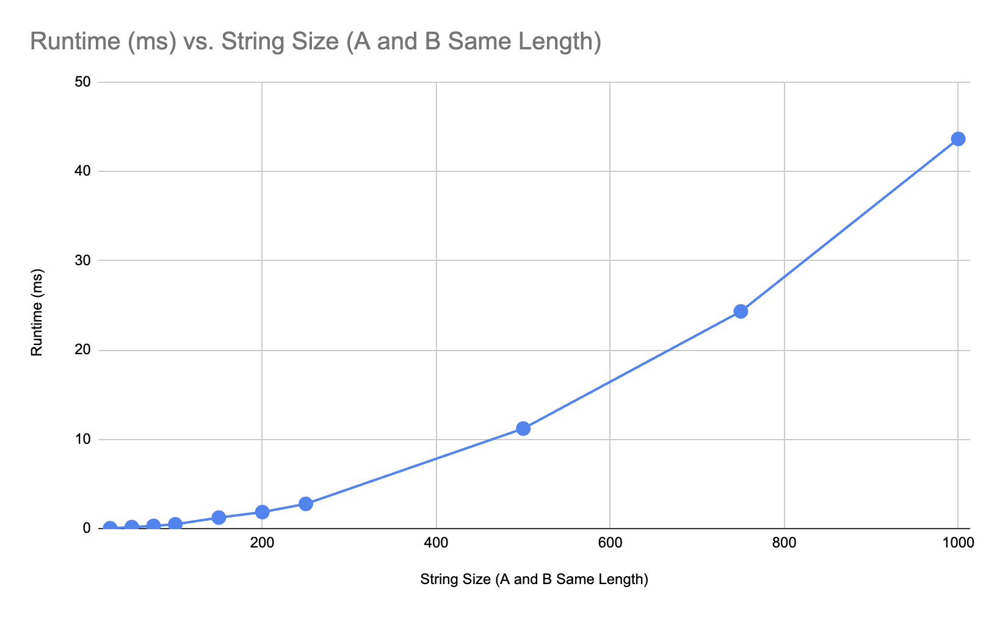
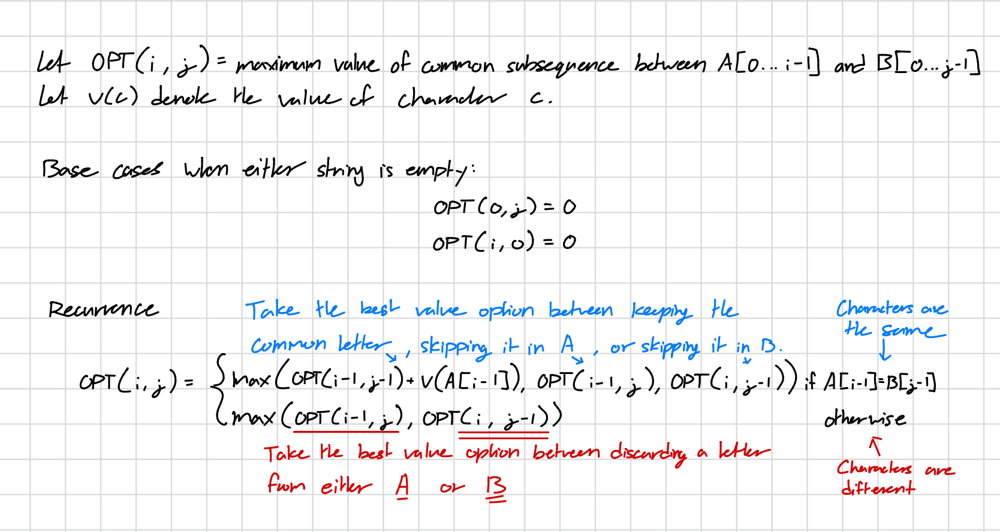

# Name
Alexander Kim (UFID: 71075724)

# Compilation

``` bash
make
```

# Testing and Running
All results are sent to output/out.txt.
You might first need to make the scripts executable
``` bash
chmod +x run.sh example.sh
```

### Running the Example
``` bash
./example.sh
```
This script runs the hvlcs executable on the input from example.in and compares it to example.out.
The result will either be a message saying the files match, or the differences between the two.

### Running Other Inputs
``` bash
./run.sh <filename-in-/data>
```
This script runs the hvlcs executable on the input from the given file argument.
Note, this file must be in the /data directory.
The ten files used to answer question 1 are available to test.

# Assumptipons
This project was developed on a mac and is intended to run in a Unix-like environment.

The project requires the following tools:
- g++ with C++17 support
- make
- bash

The HVLCS.cpp program also expects the text in the input files to exactly match 
the format specified in the assignment.

# Question 1: Empirical Comparison


# Question 2: Recurrence Equation


# Question 3: Big-Oh
```
HVLCS(A, B, val):
    n = length(A)
    m = length(B)

    // Initialize base cases
    for i = 0 to n:
        dp[i][0] = 0
    for j = 0 to m:
        dp[0][j] = 0

    // Fill table
    for i = 1 to n:
        for j = 1 to m:
            if A[i-1] == B[j-1]:
                dp[i][j] = max(dp[i-1][j-1] + v(A[i-1]), dp[i-1][j], dp[i][j-1])
            else:
                dp[i][j] = max(dp[i-1][j], dp[i][j-1])

    return dp[n][m]

Runtime: O(m * n)
